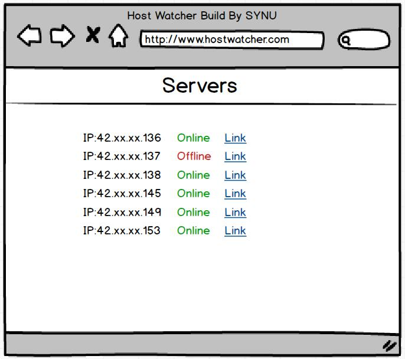

# HostWatcher
一个监测远程主机工作状态的Web站点。通过ping命令来监测。

## 版本迭代

1.实现一个静态页显示远程服务器联通状态。

效果如图

2.远程服务器状态通过Ajax可以定时刷新。

3.Ajax显示ping速度图表
DashBoard使用的是SB Admin 2
https://github.com/BlackrockDigital/startbootstrap-sb-admin-2

##安装说明

1.在IIS中启动SSI(Server Side Include)
如图所示

2.在IIS上添加网站

过程略

2.IIS服务器需要启动SSI(Server Side Include)

	1. 打开IIS控制台

	2. 左侧展开树形图

	3. 选择要安装的站点

	4. 中间切换到“功能视图”

	5. 打开“处理程序映射”

	6. 右侧选择“添加模块映射...”

	7. 请求路径输入需要启用的文件类型，如“*.html”

	8. 模块选择“ServerSideIncludeModule”

	9. “可执行程序”不选

	10. “名称”项任意

	11. 点击确定完成。